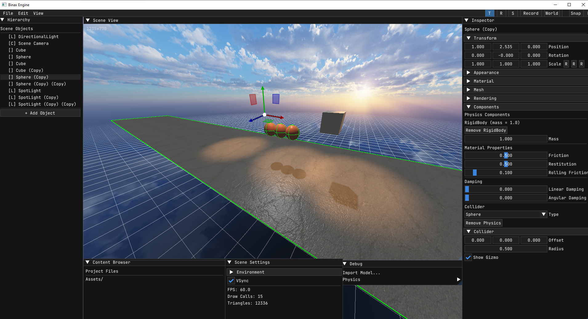

# BinaxEngine - Game Engine



---

## Features

### Editor & Workflow
- **ImGui-based interface** with docking, viewports, and custom themes
- **ImGuizmo integration** – translate (W), rotate (E), scale (R) with snap support
- **Hierarchy panel** – parent-child object relationships with drag‑and‑drop
- **Inspector panel** – edit all components (transform, appearance, light, material, mesh, physics, audio, camera, Lua scripts, animations)
- **Scene view** – camera navigation (WASD + Q/E + Shift, right-click capture)
- **Content browser** – asset management (models, textures, shaders, audio files, Lua scripts, animations)
- **Menu bar** – file operations (Save Scene, Load Scene), edit (duplicate, delete), view (wireframe, grid, gizmo, theme editor, VSync), physics (active physics, reset), skybox & shadows settings
- **Hotkeys** – Ctrl+S (save current scene), Ctrl+O (load scene), Ctrl+D (duplicate), Delete (remove object), G (toggle grid), T/R/E (gizmo mode), X (gizmo local/world), ESC (release mouse)
- **Game Mode** – run your game as a standalone executable: `BinaxEngine.exe --game scene.bxlvl` – no editor UI, fullscreen game loop with physics, scripts, and animations

### Graphics & Rendering
- **OpenGL 3.3 core profile** with seamless cubemap support
- **PBR materials** – metallic, roughness, ambient occlusion, emission
- **Normal mapping** with adjustable strength (0–5x)
- **Texture support** – diffuse, normal, roughness, metallic, AO (load via file dialog)
- **UV scaling** and **World UV** projection (triplanar mapping)
- **Dynamic lights** – directional, point, spot (up to 8 active)
- **Advanced shadow mapping**:
  - Dual‑mode shadows: High Quality (sharp, up to 30 m) and Long‑distance (blurry, up to 150 m)
  - Camera‑centric orthographic projection – no clipping at world origin
  - PCF filtering (4/9 samples), bias, softness, and map size – all adjustable in real time
- **Skybox** – cubemap‑based environment, seamless filtering
- **Grid** – customizable semi‑transparent grid with distance fade
- **Visual gizmos** – camera frustum (pyramid), light range (sphere/cone), audio range (sphere), collider (box/sphere/capsule) – each toggleable per object
- **Fog** – linear, exponential, exponential squared with adjustable color, density, start/end distance
- **Volumetric light shafts** for Spot Lights (fake volumetric cone) with adjustable intensity, softness, density

### Resource Management
- **Centralized ResourceManager** – singleton that caches textures, meshes, materials, and sounds
- **Automatic deduplication** – loading the same asset multiple times returns the cached instance
- **Memory efficient** – avoids duplicate texture/mesh loading across objects
- **Lazy loading** – resources are loaded only when first requested
- **Bulk clearing** – release all resources with a single call (useful for scene transitions)
- **Integration with Material** – textures are loaded through ResourceManager for consistency

### Audio (miniaudio)
- **2D / 3D spatial audio** – distance attenuation, listener follows active camera
- **Audio Source component** – add/remove via "Add Component" menu
- **Real‑time parameter updates** – volume, loop, min/max distance, 3D toggle – without restarting playback
- **Visual audio gizmo** – white wireframe sphere showing max distance (toggleable)
- **Supports WAV, MP3, FLAC, OGG** via miniaudio

### Physics (Bullet 3.25)
- **Rigid body dynamics** – mass, gravity, collisions
- **Collider shapes** – Box, Sphere, Capsule
- **Collider parameters** – offset, half-extents (box), radius (sphere/capsule), height (capsule)
- **Material properties** – friction (0–1), restitution (0–1), rolling friction
- **Damping** – linear and angular drag
- **Static & dynamic bodies** – mass 0 = static (e.g., ground)
- **Physics controls** – "Active Physics" toggle, "Return" reset to initial positions
- **Real‑time synchronization** – transforms updated automatically
- **Collider visualization** – green wireframe gizmos (toggleable per object)
- **Auto‑respawn on Play** – physics bodies are automatically recreated when entering Play Mode (fixes stale physics state after scene load)

### Scripting (Lua + sol2)
- **Full Lua integration** via sol2 library
- **LuaScript component** – attach scripts to any GameObject
- **Lifecycle functions** – `on_start()`, `on_update(dt)`, `on_destroy()`
- **Access from Lua**:
  - `self:GetName()`, `self:SetName()`
  - `self:GetPosition()`, `self:SetPosition()`, `self:GetWorldPosition()`
  - `self:SetVisible()`, `self:IsVisible()`
  - `FindGameObject(name)` – search by name
  - `printToConsole(msg)` – output to debug console
- **Hot reload** – scripts are automatically reloaded on each Play Mode start
- **Serialization** – Lua script paths are saved in the scene (`.bxlvl`)

### Animation System (Keyframe)
- **Custom animation format** – `.bxanim` (JSON-based)
- **Keyframe tracks** – position, rotation (quaternion slerp), scale (linear interpolation)
- **Animation Component** – add via "Add Component" menu
- **Playback controls** – Play, Stop, Pause, Loop, Speed
- **Recording mode** – select an object, press Record, manipulate transforms, press Add Key to capture keyframes, Stop Record to save `.bxanim`
- **Serialization** – animation paths are saved in scenes

### Asset Import (Assimp)
- **Model formats** – OBJ, FBX, DAE, BLEND, 3DS, STL
- **Full Unicode support** – Cyrillic characters in filenames and paths
- **Hierarchical import** – preserves object hierarchy, position, rotation, and scale from nodes
- **Material extraction** – loads diffuse, normal, roughness, metallic, AO textures
- **PBR parameter reading** – metallic/roughness factors from file
- **Mesh naming** – retains original mesh names

### Component System
- **Transform** – position, rotation, scale (with non‑uniform scale warning and auto-fix)
- **Appearance** – color, visibility
- **Light** – type, color, intensity, range, angle (spot), direction, volumetric cone (shafts)
- **Material** – textures, metallic/roughness override, emission, UV settings, transparency (alpha blend / alpha test)
- **Mesh** – switch between primitives (cube, sphere, cylinder, cone, pyramid, plane) or load external model
- **Rendering** – cast/receive shadows, enable/disable per object
- **Physics** – add/remove RigidBody, choose collider type, adjust mass, friction, restitution, rolling friction, linear/angular damping
- **Audio Source** – load audio file, volume, loop, 3D toggle, min/max distance, play/stop, show gizmo
- **Lua Script** – add script, reload, remove
- **Animation** – load `.bxanim`, play/stop/pause, loop, speed, time slider
- **Camera** – FOV, near/far plane, switch active camera, show frustum gizmo

### Scene Serialization (.bxlvl)
- **Complete scene save/load** – objects, hierarchy, transforms, meshes (primitive or model), PBR materials, lights, cameras, physics bodies, audio sources, fog, Lua scripts, animations
- **Embedded editor settings** – VSync, snap increments, shadow configs, background color, ambient strength – all stored inside the scene file (no separate config)
- **Smart workflows** – Ctrl+S overwrites the current scene without dialogs; "Save As" and "Load" via native file picker
- **Mesh persistence** – primitive types (cube, sphere, etc.) and model paths are saved and restored correctly, even after duplication

### Play Mode
- **Play/Stop toggle** – seamlessly switch between editing and gameplay
- **Physics simulation** – automatically enabled on Play, disabled on Stop
- **Script execution** – scripts are reloaded and started each Play
- **Animation playback** – all Animation components are updated every frame
- **Transform reset** – objects return to their pre‑Play positions, rotations, and scales
- **Editor tools disabled** – gizmo, grid, and selection are hidden during Play Mode
- **Stable physics** – physics bodies are recreated on Play start to ensure consistent behavior after scene loading

---

## Requirements

- **Windows 10/11** (or Linux with Wine/Proton for testing)
- **OpenGL 3.3+** (GPU with shader model 4.0)
- **Visual Studio 2022** (or any C++17‑compatible compiler)
- **CMake 3.15+**

---

## Building from Source

### 1. Clone the repository

```bash
git clone https://github.com/https://github.com/vladpim/BinaxEngine.git
cd BinaxEngine
```

### 2. Prepare dependencies

All required libraries are located in the `External/` directory:

```
External/
├── assimp/
├── bullet/
├── glfw/
├── glew/
├── glm/
├── imgui/
├── json/
├── lua/
├── miniaudio/
├── sol2/
└── stb/
```

### 3. Configure with CMake

```bash
mkdir build && cd build
cmake ..
```

### 4. Build

```bash
cmake --build . --config Release
```

The executable will be located at `build/Release/BinaxEngine.exe`.

### 5. Run

#### Editor Mode (default)
```bash
cd Release
BinaxEngine.exe
```

#### Game Mode (standalone game)
```bash
BinaxEngine.exe --game your_scene.bxlvl
```

#### Help
```bash
BinaxEngine.exe --help
```

---

## Usage Quick Start

1. **Create an object** – click "+ Add Object" in Hierarchy
2. **Edit properties** – select object, adjust in Inspector
3. **Move camera** – right‑click in Scene View, use WASD + Q/E, hold Shift to speed up
4. **Add components** – select object, go to Components section, click "Add Component"
5. **Create animation** – select object, press Record, move/rotate/scale, press Add Key, Stop Record, save `.bxanim`
6. **Write script** – create `.lua` file, add Lua Script component, load the file
7. **Play** – click Play button to test your game
8. **Stop** – click Stop to return to editing
9. **Build game** – create your scene, save it, then run: `BinaxEngine.exe --game scene.bxlvl`

---

## Libraries & Credits

BinaxEngine uses the following open‑source libraries:

- **Assimp** – model import (BSD 3-Clause)
- **Bullet Physics** – physics simulation (zlib)
- **GLFW** – window & input (zlib/libpng)
- **GLEW** – OpenGL extensions (BSD 3-Clause / MIT)
- **GLM** – mathematics (MIT)
- **ImGui** – GUI (MIT)
- **ImGuizmo** – transform tools (MIT)
- **Lua** – scripting (MIT)
- **miniaudio** – audio engine (MIT / Public Domain)
- **nlohmann/json** – JSON serialization (MIT)
- **sol2** – Lua/C++ bindings (MIT)
- **stb_image** – texture loading (Public Domain / MIT)

See [ThirdPartyLicenses.txt](ThirdPartyLicenses.txt) for full license texts.

---

## License

BinaxEngine is released under the **MIT License**. See [LICENSE](LICENSE) for details.

---

## Author

- **VladPim** – Engine & Editor development

---

## Roadmap (Planned Features)

- ✅ Skeletal animation (planned for future)
- Particle system
- In‑game UI (menus, buttons, text)
- Physics collision callbacks for Lua (`on_collision_enter`, `on_collision_exit`)
- Hot shader reloading
- Multi‑threaded rendering
- Asynchronous asset loading
- Pause mode in Play Mode
- Event system
- Per‑object physics materials (friction/restitution pairs)
- Undo/Redo (Ctrl+Z / Ctrl+Y)
- Resource packing – combine all assets into a single binary file for distribution
```
